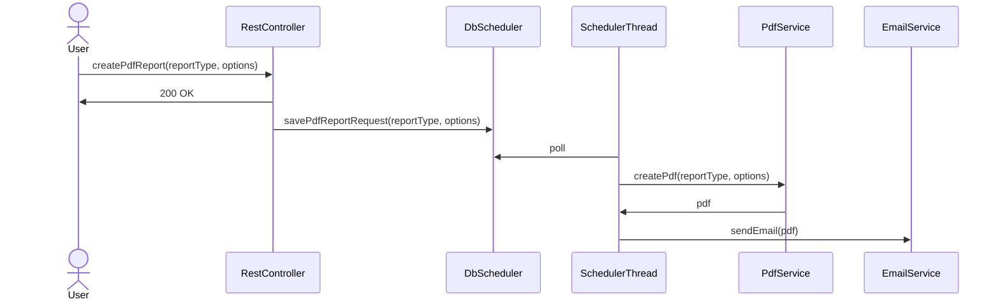
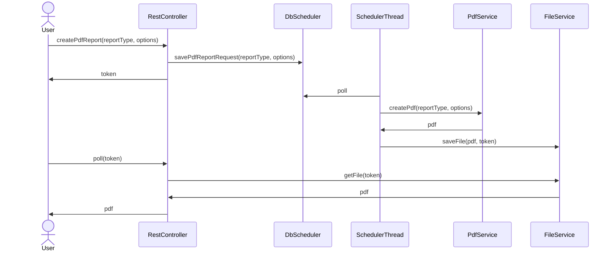

# Asynchronous PDF Generation

Large PDF reports may take a long time to generate, and synchronous endpoints may give a poor user experience for the following reasons:

- Users are not prepared to wait with no visible feedback or progress indicator whilst the PDF is being created
- Users may abandon the API call by navigating away
- The connection might get interrupted partway through downloading the rendered PDF.

The [db-scheduler](https://github.com/kagkarlsson/db-scheduler) library is already being used elsewhere in CAIS and should be used to provide robust and durable task scheduling.

## Email

In this use case, the API call returns immediately and we email the PDF to the user's email address.

Pros:
- Simple, fire-and-forget

Cons:
- No immediate feedback beyond a "check your email" instruction
- User will not be aware of email delivery issues, eg attachment limits, spam filtering etc

## File Download

There are a few variations possible on this theme: in the simple version the FE just polls for the token; in the more complex version the FE could have a "file downloads area".

Pros:
- Good user experience including progress report

Cons:
- Complex
- Requires us to build components for file storage, retrieval, etc

